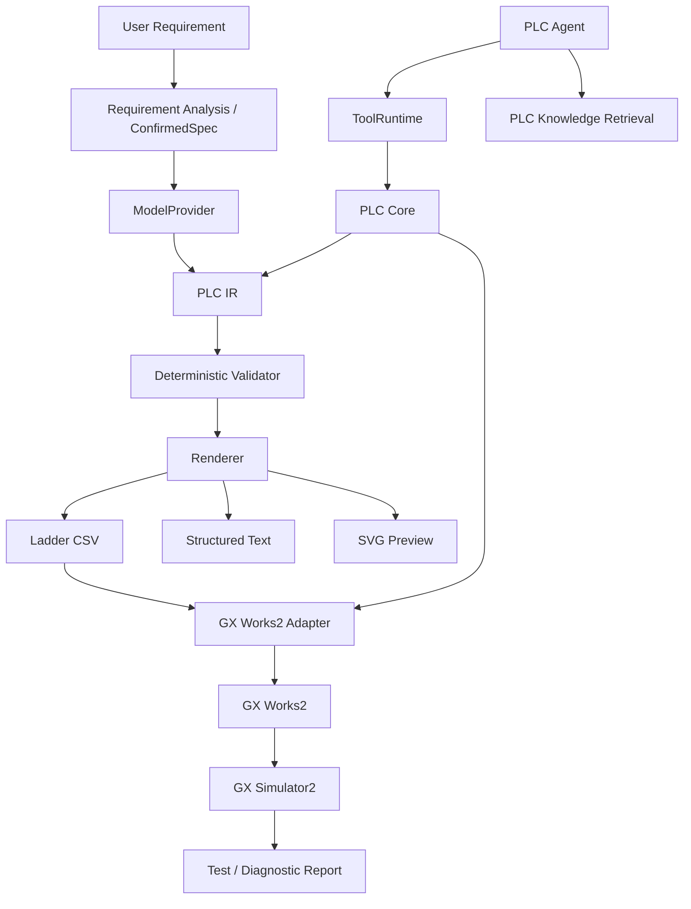

# GXWorks Agent

English | [简体中文](README.zh-CN.md)

> **AI engineering agent for Mitsubishi MELSEC PLC programming, validation, modification, simulation, and debugging.**  
> Natural language → confirmed control specification → PLC IR → deterministic validation → GX Works2 → simulation feedback.


<p align="center">
  
</p>

**GXWorks Agent** is an experimental AI engineering agent for Mitsubishi MELSEC PLC development.

Instead of treating raw LLM output as the final PLC program, GXWorks Agent places a structured engineering layer between the model and GX Works. Programs can be represented as PLC IR, checked by deterministic validators, modified through controlled engineering tools, synchronized with GX Works2, and tested through GX Simulator2.

The current implementation primarily targets **FX3U + GX Works2**.

---

## Quick Start

### Local Web workbench

On Windows 10/11, extract the **complete Web release folder**, double-click `start-web.cmd`, and select a workspace folder. Choose read-only browsing (the default) to inspect an existing workspace, or editing to create and accept candidates. Your browser opens the local operator login page once the service is ready. Keep the service window open; press `Ctrl+C` there to stop it. The release does not require a separate Python or Node.js installation.

Source setup, command-line startup, approval boundaries and MCP service connection are documented in the [Web guide](docs/integrations/web.md). Starting the workbench does not launch GX Works2 or the simulator gateway. The Qt entry below remains available; real GX/Simulator integration still requires the [Windows acceptance checks](docs/architecture/web-migration-checklist.md).

### Requirements

Core desktop workbench:

- Windows 10 / 11
- Python
- DeepSeek, Zhipu GLM, or another supported OpenAI-compatible API

For GX Works2 integration:

- Mitsubishi GX Works2

Optional for automated simulation:

- GX Simulator2
- MX Component

GX Works2, GX Simulator2, and MX Component are proprietary Mitsubishi Electric software and are not included in this repository.

### Install

```powershell
git clone https://github.com/Arienax/gxworks-agent.git
cd gxworks-agent

python -m venv .venv
.\.venv\Scripts\Activate.ps1

pip install -r requirements.txt
python src\main.py
```

### Run Tests

```powershell
pytest -q
```

A separate dependency set is also provided for Windows 7:

```powershell
pip install -r requirements-win7.txt
```

API keys are stored in Windows Credential Manager rather than repository configuration files.

---

## Capability Status

| Capability | Status |
| --- | --- |
| Natural-language requirement analysis | ✅ Working |
| Confirmed control specification | ✅ Working |
| PLC Intermediate Representation (PLC IR) | ✅ Working |
| Deterministic PLC validation | ✅ Working |
| Ladder CSV generation | ✅ Working |
| GX Works2 CSV import / export | ✅ Working |
| Program and device-comment synchronization | ✅ Working |
| Incremental network patching / diff | ✅ Working |
| FX3U manual knowledge retrieval | ✅ Working |
| Structured engineering Tool Runtime | ✅ Working |
| Structured Text generation | 🧪 Experimental |
| GX Simulator2 automated testing | 🧪 Experimental |
| GXW / Structured Ladder format research | 🔬 Research |
| Standalone MCP server (stdio) | ✅ Working |
| Structured Ladder / FBD editing | 📋 Planned |
| GX Works3 adapter | 📋 Planned |

> Status labels are intentionally conservative. Research or planned features should not be treated as supported engineering backends.

---

## Example

Describe the required machine behavior:

```text
X0 starts the motor.
X1 stops it.
Y0 drives the motor contactor.

Use a holding circuit.
Stop must have priority.

After X2 detects a workpiece,
stop the motor after 3 seconds.

The motor must not automatically restart
after power recovery.
```

A conventional LLM workflow might stop at:

```text
Prompt
  ↓
LLM
  ↓
PLC Code
```

GXWorks Agent instead works through structured engineering state:

```text
Natural Language
      ↓
Requirement Clarification
      ↓
Confirmed Control Specification
      ↓
PLC IR
      ↓
Deterministic Validation
      ↓
Ladder / ST
      ↓
GX Works2
      ↓
GX Simulator2
      ↓
Test / Diagnose / Repair
```

The Agent can clarify incomplete requirements, generate PLC logic, inspect existing programs, create targeted patches, validate candidate revisions, and use simulation feedback to support diagnosis.

---

# How It Works

## PLC Intermediate Representation

LLM output is converted into an internal **PLC Intermediate Representation (PLC IR)** instead of being treated as the final engineering artifact.

```text
                    ┌─ Ladder CSV
                    ├─ Structured Text
AI → PLC IR ────────┼─ SVG Preview
                    ├─ Validation
                    ├─ Diff / Patch
                    └─ GX Works2 Adapter
```

PLC IR provides a structured semantic layer for:

- networks
- instructions
- PLC devices
- timers and counters
- read / write dependencies
- revisions
- static analysis
- deterministic rendering
- diffs
- incremental patches

This makes program state inspectable and allows engineering operations to be performed without regenerating the entire program from free-form model output.

---

## Deterministic Validation

The model is not expected to judge the correctness of its own output.

Candidate PLC programs are checked by deterministic local code for issues such as:

- instruction structure
- device validity
- I/O references
- timers and counters
- network structure
- read / write dependencies
- PLC-specific constraints
- control-spec consistency
- common Ladder logic problems

```text
LLM
 ↓
PLC IR
 ↓
Validator
 ├──────── PASS ────────→ Render / Import
 │
 └──────── FAIL
             ↓
         Diagnostics
             ↓
           Repair
```

> **LLM for reasoning. Deterministic code for verification.**

---

## Incremental Program Editing

Existing PLC programs do not have to be regenerated from scratch.

GXWorks Agent supports network-level candidate modifications:

```text
Current PLC IR
      ↓
Requested Change
      ↓
Network Patch
      ↓
Candidate Revision
      ↓
Validation
      ↓
Diff
      ↓
User Confirmation
      ↓
Commit
```

This allows requests such as:

```text
Change the stop logic to stop-priority.

Do not modify the other networks.
```

The modification can be represented as a targeted patch and validated before it replaces the current program state.

---

## GX Works2 Integration

The current Ladder workflow uses **GX Works2 CSV import / export** as the most mature integration backend.

Supported workflows include:

- Ladder program CSV generation
- device-comment CSV generation
- GX Works2 import / export
- program synchronization
- comment synchronization
- automatic backup before overwrite
- synchronization baselines
- external modification detection
- conflict protection
- optional round-trip verification

If GXWorks Agent detects that a GX Works2 program has been manually modified since the previous synchronization, it stops instead of silently overwriting the engineer's changes.

GX Works2 GUI integration currently relies in part on GUI automation and may depend on software version, interface language, and window state.

---

# Engineering Agent

GXWorks Agent contains a built-in tool-calling PLC Agent.

The Agent operates through a structured engineering Tool Runtime rather than unrestricted low-level computer control.

Examples of engineering tools include:

```text
get_current_project
get_current_program_info
read_network
search_plc_manual
get_diagnostics
validate_project
compile_project
patch_program
validate_current_program
import_current_program_to_gxworks2
```

The intended boundary is:

```text
AI Agent
   ↓
Engineering Tools
   ↓
Tool Runtime
   ↓
PLC Core
   ├─ PLC IR
   ├─ Validator
   ├─ Knowledge Retrieval
   └─ GX Works2 Adapter
```

Low-level primitives such as arbitrary mouse input, file deletion, physical PLC writes, or unrestricted forced-device writes are not directly exposed to the model.

Engineering state changes remain behind controlled application boundaries.

---

# GX Simulator2 Automated Testing

GXWorks Agent can generate a simulation test plan from the current PLC program and execute controlled test operations through GX Simulator2.

```text
PLC Program
     ↓
AI Test Planning
     ↓
User Confirmation
     ↓
GX Simulator2
     ↓
Input Sequence
     ↓
Assertions
     ↓
Test Report
```

Simulator automation is currently **experimental**.

The local simulator gateway is intentionally separated from physical PLC access.

Its current design uses:

- localhost-only communication
- process-specific authentication
- a fixed GX Simulator2 target
- controlled device writes
- no physical PLC connection path

See [`simulator_gateway/README.md`](simulator_gateway/README.md).

The long-term engineering loop is:

```text
Generate / Modify
       ↓
Validate
       ↓
GX Works2
       ↓
Simulate
       ↓
Observe
       ↓
Diagnose
       ↓
Repair
       ↓
Validate Again
```

The complete automatic compile / diagnose / repair loop is not yet finished.

---

# FX3U Knowledge Retrieval

GXWorks Agent includes local retrieval for FX3U manuals and engineering knowledge.

The retrieval layer supports information such as:

- instruction lookup
- device constraints
- programming rules
- troubleshooting information

The repository contains a **220-case retrieval benchmark** under [`benchmarks/`](benchmarks/).

| Metric | Result |
| --- | ---: |
| Cases | 220 |
| Recall@1 | 86.27% |
| Recall@5 | 98.04% |
| Recall@10 | 100% |
| MRR | 0.9033 |
| Negative accuracy | 100% |
| Mean latency | 58.2 ms |

See [`benchmarks/fx3u_rag_benchmark_report.json`](benchmarks/fx3u_rag_benchmark_report.json) for the current report.

> These are project-internal retrieval benchmarks. They measure knowledge-retrieval performance, not end-to-end PLC program correctness or real-machine safety.

---

# Model Support

The built-in Agent uses a vendor-neutral `ModelProvider` abstraction.

| Provider | Status |
| --- | --- |
| DeepSeek | ✅ |
| Zhipu GLM | ✅ |
| Custom OpenAI-compatible API | ✅ |
| Anthropic native API | 🚧 Planned |
| Gemini native API | 🚧 Planned |
| Codex Harness / App Server | 🚧 Planned |

DeepSeek and Zhipu currently share the same OpenAI-compatible transport layer rather than separate native provider implementations.

The engineering core is intentionally separated from the model provider so PLC state, validation, and engineering operations do not depend on one specific LLM vendor.

Application-owned model responses now pass a shared language-acceptance boundary before callbacks, structured parsing, or candidate tool execution. Streaming content is buffered until acceptance; detected violations fail explicitly and retain raw diagnostics. This is a conservative check with documented language and evidence exceptions, not a guarantee of arbitrary natural-language identification. See [response-language architecture, investigation, and provider integration](docs/architecture/response-language.md).

Debug candidates now require persisted regression evidence matching the exact candidate and approved test suite before activation. Evidence includes execution snapshots, test/result fingerprints, completeness checks, and failure categories; legacy records remain readable but do not acquire new verification claims. See [the SemaPLC comparison and acceptance contract](docs/research/semaplc_comparison.md) for the design choices and runtime identity limits.

---

# MCP Integration

**MCP is an interface to GXWorks Agent, not the identity of the entire project.**

The standalone stdio server exposes the same ten high-level engineering tools as the built-in Agent. Both paths share canonical ToolCall / ToolResult objects, tool schemas, and ToolRuntime:

```text
Built-in Agent ↔ ModelProvider
      │
      └─────────────────────────────┐
                                    ↓
External MCP Client → MCP Server → ToolRuntime → PLC Core
```

The server uses the official Python MCP SDK and a separate optional Python 3.10+ environment. It reads an explicitly selected saved SessionStore project/version without starting the desktop, loading model credentials, or contacting a model.

From the checkout root in PowerShell:

```powershell
.\.venv\Scripts\python.exe -m pip install -r requirements-mcp.txt
$env:PYTHONPATH = (Resolve-Path .\src).Path
.\.venv\Scripts\python.exe -m integrations.mcp --stdio --workspace '<existing-workspace>' --project '<project-id>'
```

The process waits for an MCP client on stdin. For an automatic connection check, run `python scripts/mcp_smoke.py` in the same environment.

`patch_program` and GX import requests remain `confirmation_required`: the server prepares proposals but has no approval/commit tool or desktop confirmation bridge. It does not expose physical PLC writes, arbitrary mouse/keyboard operations, or filesystem deletion.

See [MCP setup, context selection, tools, and smoke tests](docs/integrations/mcp.md) and [Codex MCP configuration](docs/integrations/codex.md). Streamable HTTP and embedding Codex Harness / App Server remain planned integrations.

---

# GXW / Structured Ladder Research

GXWorks Agent includes an active reverse-engineering research track for GX Works2 project files and structured program representations.

Research material is available under [`docs/research/`](docs/research/).

Current research areas include:

- GXW container structure
- project object resolution
- `Program.pou` structure
- Mitsubishi instruction tokenization
- PLC semantic representation
- Structured Ladder representation
- Function-related structures
- Function Block-related structures

The current GXW research is **experimental**.

Controlled FX3U samples show that `.gxw` projects use a Microsoft Compound File Binary container with nested project data, including objects such as `Program.pou`.

The current research direction is approximately:

```text
GXW
 ↓
Container Reader
 ↓
Project Object Resolver
 ↓
Program.pou Tokenizer
 ↓
Mitsubishi Instruction Decoder
 ↓
PLC IR
```

The first engineering target is a deterministic parser.

Directly writing or reconstructing `.gxw` projects is a separate and higher-risk problem because GX Works2 projects may contain duplicated or derived state, metadata, hashes, compiler state, and other consistency requirements.

> **GXW reverse engineering is research work and is not currently a supported GXWorks Agent editing backend.**

See:

- [`docs/research/gxw_reverse_engineering.md`](docs/research/gxw_reverse_engineering.md)
- [`docs/research/gxw_structured_ladder_reverse_engineering.md`](docs/research/gxw_structured_ladder_reverse_engineering.md)
- [`docs/research/gxw_semantic_model_v1.md`](docs/research/gxw_semantic_model_v1.md)

---

# Architecture



The architecture separates AI reasoning from deterministic PLC engineering operations.

```text
                GXWorks Agent
                      │
        ┌─────────────┼─────────────┐
        ↓             ↓             ↓
     PLC Agent     PLC Core      Knowledge
        │             │           Retrieval
        ↓             ↓
   Tool Runtime     PLC IR
                      │
                 Validator
                      │
                   Renderer
                      │
                GX Works2 Adapter
                      │
                  GX Works2
                      │
                GX Simulator2
```

---

## Technology Overview

- **Core / UI:** Python, PyQt6
- **Packaging:** PyInstaller
- **PLC representation:** custom PLC IR
- **PLC integration:** GX Works2 CSV, pywinauto
- **Simulation:** GX Simulator2, MX Component, local C# gateway
- **Knowledge retrieval:** SQLite FTS5, BM25, dense retrieval, hybrid reranking
- **LLM integration:** vendor-neutral `ModelProvider` with OpenAI-compatible transport
- **Agent tool interface:** structured Tool Runtime
- **External Agent interface:** standalone MCP server over stdio

---

# Project Structure

```text
gxworks-agent/
│
├─ src/
│  ├─ main.py                  Desktop engineering workbench
│  ├─ model_provider.py        Vendor-neutral model abstraction
│  ├─ plc_agent.py             Tool-calling PLC Agent
│  ├─ plc_agent_tools.py       Engineering tool definitions
│  ├─ tool_runtime.py          Structured Agent tool boundary
│  ├─ integrations/mcp/        Standalone stdio MCP adapter
│  ├─ plc_core.py              Model-independent PLC operations
│  ├─ plc_ir.py                PLC IR / Patch / Validation / Hash
│  ├─ plc_json_validator.py    Deterministic PLC validation
│  ├─ knowledge_retriever.py   PLC manual / knowledge retrieval
│  └─ gxworks2/                GX Works2 integration
│
├─ simulator_gateway/          Local GX Simulator2 gateway
├─ resources/                  PLC models, patterns, knowledge, and assets
├─ examples/                   GX Works2 CSV examples
├─ benchmarks/                 FX3U retrieval benchmarks and reports
├─ docs/
│  ├─ localization.md
│  ├─ integrations/            MCP setup and Codex configuration
│  └─ research/                GXW / structured-program research
│
└─ tests/
```

---

# Roadmap

## Agent & Engineering Core

- [x] PLC Intermediate Representation
- [x] Deterministic validation
- [x] Incremental network patching / diff
- [x] Tool-calling PLC Agent
- [x] FX3U knowledge retrieval
- [ ] More complete compile / diagnose / repair loop
- [ ] Function / Function Block support
- [ ] Reusable FB library

## GX Works Integration

- [x] Ladder CSV generation
- [x] GX Works2 CSV import / export
- [x] Program and comment synchronization
- [ ] Structured Ladder / FBD editing
- [ ] GXW parser / serializer
- [ ] More MELSEC PLC families
- [ ] GX Works3 adapter
- [ ] Vendor-neutral PLC backend

## Simulation

- [x] GX Simulator2 gateway architecture
- [x] AI-generated simulation test planning
- [ ] Broader automated simulation coverage
- [ ] More complete diagnose / repair / retest workflow

## Agent Interfaces

- [x] Internal structured Tool Runtime
- [x] Standalone MCP server
- [x] stdio transport
- [ ] Streamable HTTP transport
- [ ] Codex Harness / App Server integration
- [ ] DeepSeek Harness integration

## Future Engineering Scope

- [ ] HMI / wider automation-project model

---

# Current Limitations

GXWorks Agent is under active development.

Current limitations include:

- development and testing primarily focus on FX3U
- Ladder CSV integration is currently the most mature backend
- Structured Text remains experimental
- GX Simulator2 automation remains experimental
- Structured Ladder / FBD editing is not implemented
- GXW parsing / serialization remains research work
- MCP supports stdio; HTTP transport and desktop approval delivery are not implemented
- GX Works2 GUI automation can depend on software version, interface language, and window state
- simulator validation does not replace real-machine commissioning

---

# Safety

PLC software controls physical equipment.

AI-generated or AI-modified PLC logic should be reviewed by qualified engineers before deployment to real machinery.

Particular attention should be paid to:

- emergency-stop circuits
- safety circuits
- mechanical interlocks
- limit switches
- homing behavior
- fail-safe behavior
- startup states
- unexpected automatic restart
- motion limits
- mechanical collision risks
- drive and servo parameters
- communication failure behavior

Simulation can reduce engineering risk, but it does not replace commissioning, machine validation, or functional-safety engineering.

---

# License

Licensed under the [Apache License 2.0](LICENSE).

---

# Disclaimer

GXWorks Agent is an independent open-source project.

It is **not affiliated with, sponsored by, or endorsed by Mitsubishi Electric**.

Mitsubishi Electric, MELSEC, GX Works2, GX Works3, GX Simulator2, and MX Component are trademarks or product names of their respective owners.
