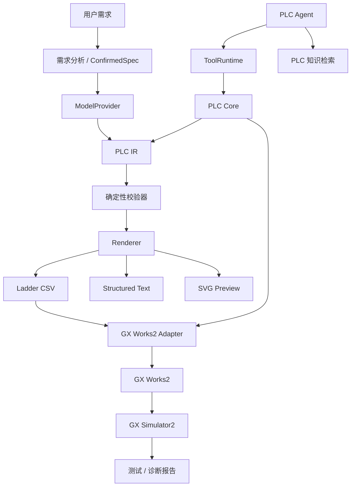

# GXWorks Agent

[English](README.md) | 简体中文

> **面向 Mitsubishi MELSEC PLC 编程、校验、修改、仿真与调试的 AI 工程 Agent。**  
> 自然语言 → 已确认控制规格 → PLC IR → 确定性校验 → GX Works2 → 仿真反馈。


<p align="center">
  
</p>

**GXWorks Agent** 是一个面向 Mitsubishi MELSEC PLC 开发流程的实验性 AI 工程 Agent。

项目不把 LLM 原始生成的 PLC 代码直接视为最终工程结果，而是在模型与 GX Works 之间加入结构化工程层：程序可以表示为 PLC IR，通过确定性校验器检查，通过受控工程工具进行修改，与 GX Works2 同步，并通过 GX Simulator2 进行仿真测试。

当前实现主要聚焦于 **FX3U + GX Works2**。

---

## 快速开始

### 环境要求

核心桌面工作台：

- Windows 10 / 11
- Python
- DeepSeek、智谱 GLM 或其他支持的 OpenAI-compatible API

如需 GX Works2 集成：

- Mitsubishi GX Works2

如需自动化仿真，可选：

- GX Simulator2
- MX Component

GX Works2、GX Simulator2 与 MX Component 均为 Mitsubishi Electric 的商业软件，本仓库不包含这些软件。

### 安装

```powershell
git clone https://github.com/Arienax/gxworks-agent.git
cd gxworks-agent

python -m venv .venv
.\.venv\Scripts\Activate.ps1

pip install -r requirements.txt
python src\main.py
```

### 运行测试

```powershell
pytest -q
```

仓库还提供一套 Windows 7 兼容依赖：

```powershell
pip install -r requirements-win7.txt
```

API Key 保存在 Windows Credential Manager 中，不写入仓库配置文件。

---

## 功能状态

| 能力 | 状态 |
| --- | --- |
| 自然语言需求分析 | ✅ 可用 |
| 已确认控制规格 | ✅ 可用 |
| PLC Intermediate Representation（PLC IR） | ✅ 可用 |
| 确定性 PLC 校验 | ✅ 可用 |
| Ladder CSV 生成 | ✅ 可用 |
| GX Works2 CSV 导入 / 导出 | ✅ 可用 |
| 程序与软元件注释同步 | ✅ 可用 |
| Network 增量 Patch / Diff | ✅ 可用 |
| FX3U 手册知识检索 | ✅ 可用 |
| 结构化工程 Tool Runtime | ✅ 可用 |
| Structured Text 生成 | 🧪 实验性 |
| GX Simulator2 自动化测试 | 🧪 实验性 |
| GXW / Structured Ladder 格式研究 | 🔬 研究中 |
| 独立 MCP Server | 🚧 开发中 |
| Structured Ladder / FBD 编辑 | 📋 计划中 |
| GX Works3 Adapter | 📋 计划中 |

> 状态标记保持保守。“研究中”和“计划中”的能力不应被视为已经可用的工程 Backend。

---

## 示例

直接描述所需控制行为：

```text
X0 启动电机。
X1 停止电机。
Y0 驱动电机接触器。

需要自锁。
停止必须优先。

X2 检测到工件后，
延时 3 秒停止电机。

掉电恢复后电机不能自动重新启动。
```

传统的 LLM 工作流可能停留在：

```text
Prompt
  ↓
LLM
  ↓
PLC 代码
```

GXWorks Agent 则通过结构化工程状态处理任务：

```text
自然语言需求
      ↓
需求澄清
      ↓
已确认控制规格
      ↓
PLC IR
      ↓
确定性校验
      ↓
Ladder / ST
      ↓
GX Works2
      ↓
GX Simulator2
      ↓
测试 / 诊断 / 修复
```

Agent 可以澄清不完整需求、生成 PLC 逻辑、检查已有程序、生成局部 Patch、验证候选 Revision，并使用仿真反馈辅助诊断。

---

# 工作原理

## PLC 中间表示（PLC IR）

LLM 输出不会直接作为最终工程产物，而是先转换为内部 **PLC Intermediate Representation（PLC IR）**。

```text
                    ┌─ Ladder CSV
                    ├─ Structured Text
AI → PLC IR ────────┼─ SVG Preview
                    ├─ Validation
                    ├─ Diff / Patch
                    └─ GX Works2 Adapter
```

PLC IR 为以下工程信息提供结构化语义层：

- Network
- PLC 指令
- 软元件
- 定时器与计数器
- 读 / 写依赖
- Revision
- 静态分析
- 确定性渲染
- Diff
- 增量 Patch

这样可以对 PLC 程序状态进行检查和局部修改，而不需要每次依赖模型重新生成整份自由文本程序。

---

## 确定性校验

模型不会负责判断“自己生成的程序是否正确”。

候选 PLC 程序会由本地确定性代码检查，例如：

- 指令结构
- 软元件合法性
- I/O 引用
- 定时器和计数器
- Network 结构
- 读 / 写依赖
- PLC 特定约束
- 控制规格一致性
- 常见梯形图逻辑问题

```text
LLM
 ↓
PLC IR
 ↓
Validator
 ├──────── PASS ────────→ Render / Import
 │
 └──────── FAIL
             ↓
           诊断
             ↓
           修复
```

> **LLM 负责推理，确定性代码负责验证。**

---

## 增量程序修改

已有 PLC 程序不需要每次从头重新生成。

GXWorks Agent 支持以 Network 为单位构造候选修改：

```text
Current PLC IR
      ↓
修改要求
      ↓
Network Patch
      ↓
Candidate Revision
      ↓
Validation
      ↓
Diff
      ↓
用户确认
      ↓
Commit
```

例如：

```text
把停止逻辑改成停止优先。

不要修改其他 Network。
```

修改可以先表示为局部 Patch，在真正替换当前程序状态之前进行确定性校验。

---

## GX Works2 集成

当前 Ladder 工作流以 **GX Works2 CSV 导入 / 导出**作为最成熟的集成 Backend。

当前支持：

- Ladder 程序 CSV 生成
- 软元件注释 CSV 生成
- GX Works2 导入 / 导出
- 程序同步
- 注释同步
- 覆盖前自动备份
- 同步 Baseline
- 外部人工修改检测
- 冲突保护
- 可选 Round-trip Verification

如果 GXWorks Agent 检测到 GX Works2 中的程序在上一次同步之后被人工修改，会停止自动覆盖，而不是静默抹掉工程人员的修改。

GX Works2 GUI 集成目前部分依赖 GUI 自动化，因此可能受到软件版本、界面语言和窗口状态影响。

---

# Engineering Agent

GXWorks Agent 内置 Tool-calling PLC Agent。

Agent 通过结构化工程 Tool Runtime 工作，而不是直接获得无限制的底层计算机控制能力。

工程工具示例：

```text
get_current_project
get_current_program_info
read_network
search_plc_manual
get_diagnostics
validate_project
compile_project
patch_program
validate_current_program
import_current_program_to_gxworks2
```

整体边界为：

```text
AI Agent
   ↓
Engineering Tools
   ↓
Tool Runtime
   ↓
PLC Core
   ├─ PLC IR
   ├─ Validator
   ├─ Knowledge Retrieval
   └─ GX Works2 Adapter
```

任意鼠标输入、文件删除、真实 PLC 写入或无限制的强制软元件操作等底层原语不会直接暴露给模型。

工程状态修改始终位于受控应用边界之后。

---

# GX Simulator2 自动化测试

GXWorks Agent 可以根据当前 PLC 程序生成仿真测试方案，并通过 GX Simulator2 执行受控测试操作。

```text
PLC Program
     ↓
AI Test Planning
     ↓
用户确认
     ↓
GX Simulator2
     ↓
输入序列
     ↓
断言
     ↓
测试报告
```

Simulator 自动化目前属于**实验性能力**。

本地 Simulator Gateway 被刻意设计为与真实 PLC 访问隔离。

当前设计包括：

- 仅允许 localhost 通信
- 每进程独立认证
- 固定 GX Simulator2 目标
- 受控软元件写入
- 不提供物理 PLC 连接路径

详见 [`simulator_gateway/README.md`](simulator_gateway/README.md)。

长期希望形成的工程闭环为：

```text
生成 / 修改
     ↓
确定性校验
     ↓
GX Works2
     ↓
仿真
     ↓
观察结果
     ↓
诊断
     ↓
修复
     ↓
再次校验
```

完整的自动 `compile / diagnose / repair` 闭环目前尚未完成。

---

# FX3U 知识检索

GXWorks Agent 包含本地 FX3U 手册与工程知识检索。

检索层可以辅助查询：

- PLC 指令
- 软元件约束
- 编程规则
- 故障排查信息

仓库在 [`benchmarks/`](benchmarks/) 中提供了 **220 个 Case 的检索 Benchmark**。

| 指标 | 结果 |
| --- | ---: |
| Cases | 220 |
| Recall@1 | 86.27% |
| Recall@5 | 98.04% |
| Recall@10 | 100% |
| MRR | 0.9033 |
| Negative accuracy | 100% |
| Mean latency | 58.2 ms |

当前报告见：

[`benchmarks/fx3u_rag_benchmark_report.json`](benchmarks/fx3u_rag_benchmark_report.json)

> 这些是项目内部的知识检索 Benchmark，用于衡量 Retrieval 性能，不代表端到端 PLC 程序正确率，也不代表真实设备上的安全性。

---

# 模型支持

内置 Agent 使用与模型厂商无关的 `ModelProvider` 抽象。

| Provider | 状态 |
| --- | --- |
| DeepSeek | ✅ |
| 智谱 GLM | ✅ |
| 自定义 OpenAI-compatible API | ✅ |
| Anthropic 原生 API | 🚧 计划中 |
| Gemini 原生 API | 🚧 计划中 |
| Codex Harness / App Server | 🚧 计划中 |

DeepSeek 与智谱目前共享同一个 OpenAI-compatible Transport，而不是分别维护两套原生 Provider 实现。

工程核心与模型 Provider 相互分离，因此 PLC 状态、校验和工程操作不会绑定到某一个特定 LLM 厂商。

---

# MCP 集成

**MCP 是 GXWorks Agent 的一种外部接口，而不是整个项目本身。**

当前代码已经包含结构化 Tool Runtime，并使用统一的 ToolCall / ToolResult 对象和结构化 Tool Schema：

```text
Built-in Agent
      ↓
 ModelProvider
      ↓
 ToolRuntime
      ↓
   PLC Core
      ↓
GX Works2 Adapter
```

当前版本**尚未向外部 MCP Client 暴露独立的标准 MCP Server**。

计划中的外部架构为：

```text
Codex ──────────────┐
Claude Code ────────┤
Other AI Agents ────┼──→ MCP Interface
                    │
Built-in Agent ─────┘
                           ↓
                     GXWorks Agent
                           ↓
                        PLC Core
                           ↓
                       GX Works2
```

计划支持：

- stdio
- Streamable HTTP

这样 MCP 只是系统的一种接入方式，而底层 PLC 工程核心仍然可以直接由内置 Agent 使用。

---

# GXW / Structured Ladder 逆向研究

GXWorks Agent 仓库包含一条针对 GX Works2 工程文件和结构化程序表示的持续逆向研究路线。

研究文档位于：

[`docs/research/`](docs/research/)

目前研究内容包括：

- GXW 容器结构
- 工程对象解析
- `Program.pou` 结构
- Mitsubishi 指令 Tokenization
- PLC 语义模型
- Structured Ladder 表示
- Function 相关结构
- Function Block 相关结构

当前 GXW 研究仍属于**实验性研究**。

受控 FX3U 样本显示，`.gxw` 工程使用 Microsoft Compound File Binary 容器，并包含嵌套的工程数据，其中包括 `Program.pou` 等对象。

目前研究路线大致为：

```text
GXW
 ↓
Container Reader
 ↓
Project Object Resolver
 ↓
Program.pou Tokenizer
 ↓
Mitsubishi Instruction Decoder
 ↓
PLC IR
```

当前首先需要解决的是确定性的工程解析能力。

直接写入或重新构造 `.gxw` 是独立且风险更高的问题，因为 GX Works2 工程可能同时包含重复或派生状态、Metadata、Hash、Compiler State 以及其他一致性要求。

因此：

> **GXW 逆向目前属于研究内容，尚不是 GXWorks Agent 已支持的工程编辑 Backend。**

相关文档：

- [`docs/research/gxw_reverse_engineering.md`](docs/research/gxw_reverse_engineering.md)
- [`docs/research/gxw_structured_ladder_reverse_engineering.md`](docs/research/gxw_structured_ladder_reverse_engineering.md)
- [`docs/research/gxw_semantic_model_v1.md`](docs/research/gxw_semantic_model_v1.md)

---

# 系统架构



架构上将 AI 推理与确定性的 PLC 工程操作分离：

```text
                GXWorks Agent
                      │
        ┌─────────────┼─────────────┐
        ↓             ↓             ↓
     PLC Agent     PLC Core      Knowledge
        │             │           Retrieval
        ↓             ↓
   Tool Runtime     PLC IR
                      │
                 Validator
                      │
                   Renderer
                      │
                GX Works2 Adapter
                      │
                  GX Works2
                      │
                GX Simulator2
```

---

## 技术概览

- **Core / UI：** Python、PyQt6
- **Packaging：** PyInstaller
- **PLC 表示：** 自定义 PLC IR
- **PLC 集成：** GX Works2 CSV、pywinauto
- **仿真：** GX Simulator2、MX Component、本地 C# Gateway
- **知识检索：** SQLite FTS5、BM25、Dense Retrieval、Hybrid Reranking
- **LLM 集成：** Vendor-neutral `ModelProvider` + OpenAI-compatible Transport
- **Agent Tool Interface：** Structured Tool Runtime
- **External Agent Interface：** 独立 MCP Transport 开发中

---

# 项目结构

```text
gxworks-agent/
│
├─ src/
│  ├─ main.py                  桌面工程工作台
│  ├─ model_provider.py        与模型厂商无关的抽象层
│  ├─ plc_agent.py             Tool-calling PLC Agent
│  ├─ plc_agent_tools.py       工程工具定义
│  ├─ tool_runtime.py          结构化 Agent Tool Boundary
│  ├─ plc_core.py              与模型无关的 PLC 操作层
│  ├─ plc_ir.py                PLC IR / Patch / Validation / Hash
│  ├─ plc_json_validator.py    确定性 PLC 校验
│  ├─ knowledge_retriever.py   PLC 手册 / 工程知识检索
│  └─ gxworks2/                GX Works2 集成
│
├─ simulator_gateway/          本地 GX Simulator2 Gateway
├─ resources/                  PLC 型号、Pattern、知识与资源文件
├─ examples/                   GX Works2 CSV 示例
├─ benchmarks/                 FX3U 检索 Benchmark 与报告
├─ docs/
│  ├─ localization.md
│  └─ research/                GXW / Structured Program 研究
│
└─ tests/
```

---

# Roadmap

## Agent 与工程核心

- [x] PLC Intermediate Representation
- [x] 确定性校验
- [x] Network 增量 Patch / Diff
- [x] Tool-calling PLC Agent
- [x] FX3U 知识检索
- [ ] 更完整的 compile / diagnose / repair 闭环
- [ ] Function / Function Block 支持
- [ ] 可复用 FB Library

## GX Works 集成

- [x] Ladder CSV 生成
- [x] GX Works2 CSV 导入 / 导出
- [x] 程序与注释同步
- [ ] Structured Ladder / FBD 编辑
- [ ] GXW Parser / Serializer
- [ ] 更多 MELSEC PLC 系列
- [ ] GX Works3 Adapter
- [ ] Vendor-neutral PLC Backend

## 仿真

- [x] GX Simulator2 Gateway 架构
- [x] AI 仿真测试方案生成
- [ ] 扩展自动化仿真覆盖
- [ ] 更完整的 diagnose / repair / retest 工作流

## Agent 接口

- [x] 内部 Structured Tool Runtime
- [ ] 独立 MCP Server
- [ ] stdio Transport
- [ ] Streamable HTTP Transport
- [ ] Codex Harness / App Server 集成
- [ ] DeepSeek Harness 集成

## 后续工程范围

- [ ] HMI / 更完整的自动化工程模型

---

# 当前限制

GXWorks Agent 仍处于持续开发阶段。

目前主要限制包括：

- 主要围绕 FX3U 开发和测试
- Ladder CSV 集成目前是最成熟的 Backend
- Structured Text 仍属于实验性能力
- GX Simulator2 自动化仍属于实验性能力
- Structured Ladder / FBD 编辑尚未实现
- GXW Parser / Serializer 仍处于研究阶段
- 独立 MCP Transport 尚未实现
- GX Works2 GUI 自动化可能受软件版本、界面语言与窗口状态影响
- Simulator 验证不能替代真实设备调试与验收

---

# 安全说明

PLC 软件会控制真实物理设备。

AI 生成或 AI 修改的 PLC 程序在部署到真实机械设备之前，应由具备相应经验的工程人员进行审查与验证。

尤其需要关注：

- 急停回路
- 安全回路
- 机械互锁
- 极限位
- 回零逻辑
- 故障安全行为
- 上电初始状态
- 非预期自动重启
- 运动范围
- 机械碰撞风险
- 驱动器与伺服参数
- 通信故障行为

仿真可以降低工程风险，但不能替代真实设备 Commissioning、设备验收或功能安全设计。

---

# License

本项目采用 [Apache License 2.0](LICENSE)。

---

# Disclaimer

GXWorks Agent 是一个独立的开源项目。

本项目**与 Mitsubishi Electric 不存在隶属、赞助或官方认可关系**。

Mitsubishi Electric、MELSEC、GX Works2、GX Works3、GX Simulator2 和 MX Component 等名称与商标归其各自权利人所有。