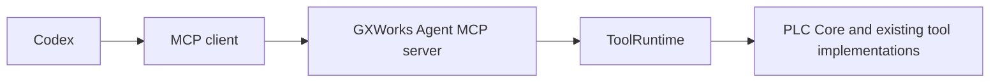

# Codex integration

## A. Codex uses GXWorks Agent tools over MCP — implemented



Install the optional MCP environment and identify your saved workspace/project
as described in [MCP setup](mcp.md). Codex launches the same standalone server as
any other MCP client. No Codex-specific PLC implementation or model API key is
needed by that server.

Codex supports stdio server configuration in `~/.codex/config.toml` or a trusted
project's `.codex/config.toml`. Its `command`, `args`, `cwd` and `env` fields control
the subprocess. See the [official MCP configuration documentation](https://learn.chatgpt.com/docs/extend/mcp?surface=cli).

Windows example (replace each `<...>` placeholder; forward slashes avoid TOML
backslash escapes):

```toml
[mcp_servers.gxworks]
command = "<checkout>/.venv/Scripts/python.exe"
args = ["-m", "integrations.mcp", "--stdio", "--workspace", "<workspace>", "--project", "<project-id>"]
cwd = "<checkout>/src"
startup_timeout_sec = 30
tool_timeout_sec = 120
```

Use absolute paths for the actual checkout, Python executable and workspace.
The example contains no developer-specific path. Setting `cwd` to `src` lets
Python find both the adapter package and the repository's existing flat modules.
Append `"--version", "v0001"` to `args` to pin a saved version; otherwise calls
follow the saved active version. This does not follow unsaved GUI selection.

Generic configuration, for a compatible host with a copied saved workspace:

```toml
[mcp_servers.gxworks]
command = "<checkout>/.venv/bin/python"
args = ["-m", "integrations.mcp", "--stdio", "--workspace", "<workspace>", "--project", "<project-id>", "--version", "v0001"]
cwd = "<checkout>/src"
startup_timeout_sec = 30
tool_timeout_sec = 120
```

The generic form is provided for portability; this change was tested on Windows.
Live GX/Simulator integration remains Windows-specific.

Alternatively, PowerShell can register the command through Codex's CLI:

```powershell
$Checkout = (Resolve-Path .).Path
$McpPython = Join-Path $Checkout '.venv\Scripts\python.exe'
$Source = Join-Path $Checkout 'src'
$Workspace = '<existing SessionStore workspace directory>'
$ProjectId = '<saved project ID>'
codex mcp add gxworks --env "PYTHONPATH=$Source" -- $McpPython -m integrations.mcp --stdio --workspace $Workspace --project $ProjectId
codex mcp list
```

Use either the configuration file or CLI registration for this server. This
repository does not change your Codex configuration automatically. In Codex's
terminal UI, `/mcp` shows active MCP servers. These commands are documented in
the [official Codex MCP guide](https://learn.chatgpt.com/docs/extend/mcp?surface=cli).

Try a read-only request:

> Use the gxworks MCP tools to read the current project and program information,
> then read network N0001 if it exists. Report the saved project and version IDs.

For patches or import requests, `confirmation_required` remains pending. The
standalone server cannot approve or deliver proposals to the desktop. Codex
approval of an MCP call does not approve the underlying engineering action.
See [confirmation semantics](mcp.md#confirmation-and-safety).

The server process was tested with the official MCP client, including actual
stdio discovery and read-only invocation. The examples are checked against the
Codex documentation; a live Codex session using the saved configuration is not
part of the automated test suite.

## B. GXWorks Agent embeds Codex Harness / App Server — planned

This is the opposite integration direction: the workbench would host a Codex
agent session through `codex app-server`. It is not implemented by the MCP
adapter. The [official App Server interface](https://learn.chatgpt.com/docs/app-server)
includes threads, turns, approval requests and streamed agent events.

A future boundary could be:

```text
AgentBackend (future)
├── BuiltinAgentBackend
│   ├── ModelProvider
│   └── ToolRuntime
└── CodexHarnessBackend
    ├── Codex App Server
    └── GXWorks MCP tools → ToolRuntime
```

Treat App Server as an agent harness, with explicit ownership of threads/turns,
approvals, tool execution, filesystem/sandbox events and diffs. Do not squeeze it
into an OpenAI-compatible ModelProvider if that loses these semantics. A future
backend must coordinate engineering confirmations with the desktop while keeping
PLC logic in the shared runtime. No AgentBackend refactor, App Server process,
thread/event bridge or harness approval implementation is included in Phase 1.
