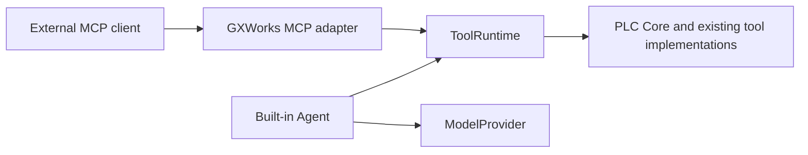

# Standalone GXWorks Agent MCP server

The stdio server is working. External agents discover and call the same twelve
high-level tools used by the built-in agent. The server reads an existing saved
project through SessionStore; it does not launch the desktop or contact a model.



## Install and start

Use a separate Python 3.10+ environment. The optional requirements pin the
[official Python MCP SDK](https://github.com/modelcontextprotocol/python-sdk)
to 2.1.1. The desktop requirements and Windows 7 dependency set are unchanged;
the MCP process is not a Windows 7 build. No PyQt, OpenAI SDK, model API key,
GX Works2, GX Simulator2 or MX Component is needed for this interface.

From the checkout root in Windows PowerShell:

```powershell
python -m venv .venv
.\.venv\Scripts\python.exe -m pip install -r requirements-mcp.txt
$env:PYTHONPATH = (Resolve-Path .\src).Path
$Workspace = '<existing SessionStore workspace directory>'
$ProjectId = '<saved project ID>'
.\.venv\Scripts\python.exe -m integrations.mcp --stdio --workspace $Workspace --project $ProjectId
```

The command waits for an MCP client on stdin. Use the smoke test below for an
automatic check, or configure your agent to launch it. Each stdio connection
launches its own server process. `--stdio` is the default and the only transport
exposed by this CLI. Logs, errors and `--help` go to stderr; stdout contains
protocol data.

Generic shell form, from a checkout with an existing saved workspace:

```sh
python3 -m venv .venv
.venv/bin/python -m pip install -r requirements-mcp.txt
PYTHONPATH="$PWD/src" .venv/bin/python -m integrations.mcp --stdio \
  --workspace '<existing-workspace>' --project '<project-id>' --version v0001
```

The deterministic interface does not require Windows credentials. Live GX and
simulator integration remains Windows-specific; non-Windows execution has not
been validated as part of this change.

## Select a saved engineering context

Point `--workspace` at the desktop's existing SessionStore workspace, which
contains `index.json` and `projects/<project-id>/project.json`. You can instead
set `PLC_AI_WORKSPACE_DIR`. The server deliberately requires an explicit
workspace or that environment variable; it does not guess a Qt application-data
location or create an empty workspace. The desktop's default location is its
`QStandardPaths.AppDataLocation / workspace`.

List saved IDs and active versions using PowerShell:

```powershell
Get-ChildItem -LiteralPath (Join-Path $Workspace 'projects') -Directory |
  ForEach-Object {
    Get-Content -LiteralPath (Join-Path $_.FullName 'project.json') -Raw |
      ConvertFrom-Json
  } | Select-Object id, name, active_version_id
```

`--project` is required. `--version` pins a saved version; when omitted, each
call follows that project's persisted `active_version_id`. A project with no
version supports project summaries, generation context and initial program
candidates. An invalid project, missing selected version, unreadable ladder or
changed metadata returns a context error;
there is no fallback to another project or version. IDs and loaded artifact
paths are checked to stay within their storage directories.

This is saved state. A GUI selection that has not been persisted is not visible.
For a sequence of related engineering calls, pin the version. Each call copies
its own context, and changing metadata during a load is rejected so the client
can retry. Existing saved versions are expected to remain immutable.

`SessionToolContextProvider` reuses SessionStore's project defaults, version
records, canonical IR validation and legacy ladder conversion. It passes
`create=False` and `persist_legacy=False`, so loading never creates a workspace
or writes a migrated IR. Desktop defaults retain migration-on-view. No new
project storage format is introduced.

`StaticToolContextProvider` supplies copied snapshots for embedding and tests.
A future desktop bridge can implement `ToolContextProvider.get_context()` to
return a GUI-selected snapshot without making this adapter depend on widgets.
That bridge and desktop approval delivery are not implemented.

## Tools and results

`tools/list` translates `ToolRuntime.list_tools()` schemas to MCP `inputSchema`;
`SAFE_TOOL_NAMES` filters discovery and calls. The source of definitions remains
`ToolRegistry`, including nested patch schemas. There is no second tool catalog.

Available operations include project/program summaries, generation context,
initial ladder candidates, network reads, local manual search, diagnostics,
validation, temporary compilation, candidate patches
and GX import requests. Manual search uses the existing bundled local knowledge
index. Installing NumPy in the MCP environment optionally enables the existing
dense retrieval path; without it the retriever uses its lexical fallback.

Every allowed call becomes a canonical `ToolCall` and passes through
`ToolRuntime.invoke`. Argument validation and PLC behavior remain in the registry
and existing implementations. MCP's result contains:

- `content`: JSON text of the public ToolResult envelope (or the runtime's text
  for a text-only result).
- `structuredContent`: the same public envelope, without the desktop model
  prompt's 18,000-character truncation.
- `isError`: the runtime error flag, with original error codes/messages.
- `_meta.gxworks`: call ID, tool name and, when context was loaded, project and
  version IDs. Incoming client metadata is not echoed.

Runtime errors such as `INVALID_ARGUMENTS` and `TOOL_FAILED` remain tool errors.
Unlisted or forbidden calls return `UNKNOWN_TOOL` without invoking the runtime.
Context failures return `CONTEXT_UNAVAILABLE`; unexpected adapter/runtime
exceptions return a generic error with details only in server logs. Public
status, diffs, hashes, candidate IDs and pending-action fields survive the
boundary. `public_tool_result_data` recursively removes private fields, including
`_candidate_ir` and `_confirmed_spec`; raw `ToolResult.data` is never sent.

## Initial ladder generation

An external agent can supply the model output for the first program in a saved
project, including a project with no versions. It designs `ladder_v1` itself;
the server never calls DeepSeek, OpenAI or another model provider.

```text
get_generation_context
  → agent designs ladder_v1 (optionally search_plc_manual)
  → create_program_candidate
  → ToolRuntime.invoke → shared ToolRegistry handler
  → PLCCore.create_program_candidate
      → validate_ladder_full(require_catalogued_instructions=True)
      → generation shape check → build_plc_ir(revision=1)
      → PLCCore.validate_project (validate_plc_ir + static diagnostics)
  → PLCCore.compile_project (temporary directory, removed on completion/failure)
  → status: confirmation_required
```

`get_generation_context` takes exactly this input schema:

```json
{"type":"object","properties":{},"additionalProperties":false}
```

Its public `data` contains `project_id`, `plc_model`, `target_mode`,
`workflow_mode`, `has_confirmed_spec`, `confirmed_spec` and `output_contract`.
The confirmed specification is a field-by-field projection of the context's
selected version snapshot, or the project specification when there is no
snapshot. It includes the requirement summary/notes, confirmed parameters,
selected approach and generation contract, canonical `io_table`, relevant
hardware profile/context, execution semantics and static-analysis constraints
when present. Legacy I/O text is returned only when no canonical table exists.
With no confirmed specification it returns `has_confirmed_spec: false` and
`confirmed_spec: null`; a specification is not fabricated. Unselected approaches,
review drafts, chat history, filesystem paths, credentials, provider settings
and UI objects are excluded. The full stored specification stays local and is
passed unchanged to the core, including for the confirmation hash.

`output_contract` contains `format: "ladder_v1"`, a complete standalone JSON
schema, textual rules and a list of server-owned fields. The model-free
[`plc_generation_contract.py`](../../src/plc_generation_contract.py) is the source
of this schema and the nested `ladder` schema in `create_program_candidate`.
Label length and application-opcode token rules are also shared with the
existing validator. `api.py` and its model prompts/transport behavior are unchanged.

`create_program_candidate` has an object input with `additionalProperties: false`:

| Property | Schema | Required |
| --- | --- | --- |
| `program_name` | string, 1–64 characters, default `MAIN`; whitespace-only names rejected | No |
| `ladder` | full `ladder_v1_schema()` | Yes |

The ladder schema permits only `device_comments` (object with string comments
of at most 64 characters) and `rungs` (nonempty array). Each rung requires
`rung_id` (nonnegative integer), `header_element` (null or a simple input) and
`branches` (nonempty array); `shared_inputs` and `debug_note` are optional.
Each branch requires `branch_id` (integer ≥1), `y_offset_level` (integer ≥0),
`inputs` (array) and `outputs` (nonempty array). Inputs use NO/NC/P/F/COMPARE or a
single-level `parallel_block`; RISING/FALLING/BLOCK_INPUT remain explicit
compatibility aliases. Outputs use COIL/PLS/PLF/TIMER/COUNTER/APP_INSTR. Labels
and notes allow null and have a 64-character limit. Extra rung/element fields,
nested parallel blocks, import-only BLOCK_OUTPUT expressions and APP_INSTR OUT
are rejected for new candidates. This shape check does not change the legacy
import, built-in generation or patch validators.

The context supplies the PLC model and confirmed specification. The core fixes
revision to 1 and generates candidate IDs and hashes. There are no model input
fields for project/model overrides, revisions, specifications, IDs or hashes.
Canonical networks, instructions, reads/writes, devices, timing, logic, static
analysis, I/O map and source hashes are always built locally. The agent must not
submit a canonical IR or attempt to override derived fields.

Successful results contain diagnostics, network/device counts and a
`pending_action` of type `accept_generated_program`, with `project_id`,
`project_name`, `program_name`, candidate ID, revision,
candidate/ladder/specification hashes and temporary artifact hashes.
Private `_candidate_ir` and `_confirmed_spec` remain
only in the in-process result. Public MCP text and structured results contain
neither field. A validation or compilation failure is a tool error, never a
confirmation request. The server does not retry or invoke a repair model.
Server instructions direct the agent to correct reported errors and make at
most two retries (three submissions total), then report remaining failures.

Use `get_current_program_info → read_network → patch_program` for edits to an
existing program; that workflow and its revision/confirmation behavior remain
unchanged. Do not edit SessionStore files to bypass either tool path.

## Confirmation and safety

`create_program_candidate` and `patch_program` validate and temporarily compile
a candidate. They do not save a new project version or change `active_version_id`.
`import_current_program_to_gxworks2` only prepares an import request.
All three return `status: "confirmation_required"` with a public
`pending_action`, even though `isError` is false. This means preparation succeeded,
not that the action was applied. An MCP client's tool-call approval is not PLC
engineering confirmation.

The standalone server has no approve/accept/commit tool, no auto-approval flag,
no retained candidate queue and no delivery into the desktop's confirmation UI.
Candidate IDs are audit identifiers, not resumable approval tokens. To apply a
change, reproduce and review it in the existing desktop workflow and confirm
there. Do not tell users an MCP proposal has already changed their project or GX
state. A future bridge must preserve the existing guarded confirmation points.

Mouse/keyboard primitives, filesystem deletion, `write_plc`, `force_device` and
unrestricted physical PLC writes are not exposed. Compilation uses the existing
temporary artifact pipeline; generated temporary files are removed by PLC Core.

## Tests and smoke test

With the MCP environment active, run from the checkout root:

```text
python -m pip install -r requirements-mcp.txt pytest
python -m pytest -q tests/test_mcp.py tests/test_architecture_boundaries.py
python scripts/mcp_smoke.py
```

The smoke script creates a temporary persisted project, launches
`python -m integrations.mcp --stdio` as a real subprocess and uses the official
SDK client for `initialize → tools/list → tools/call(read_network)`. It checks
the allow-list and response contents, then starts another subprocess for a
versionless project and calls `get_generation_context → create_program_candidate`.
It asserts `confirmation_required`, zero saved versions, unchanged active version
and unchanged workspace contents. Both child processes close and the temporary
workspace is removed. It exits nonzero on failure. No model or network is
used. The SDK negotiates protocol versions; the explicit initialize smoke test
exercises its legacy-session compatibility, while in-memory SDK client tests
also exercise the current connection flow.

Tests cover discovery, schema fidelity, invocation, invalid and unknown calls,
errors, pending confirmations, large structured results, recursive redaction,
snapshot selection, non-writing legacy reads and import boundaries. A separate
real subprocess test rejects imports of Qt, `api`, `model_provider`, model
settings/credentials and device automation, and injects Python/native stdout
noise to verify that only MCP messages reach the client.

Run the full desktop suite in an environment with the appropriate desktop
requirements plus the optional MCP requirements:

```text
python -m pytest -q
```

Without the optional SDK, the MCP test module is skipped. That does not count
as MCP validation. The existing live GX availability tests may skip when GX
Works2 is not running or no program is open.

For an optional interactive check with Node.js 22.19+ and
[MCP Inspector](https://github.com/modelcontextprotocol/inspector), set PYTHONPATH
as above, then run:

```powershell
npx @modelcontextprotocol/inspector .\.venv\Scripts\python.exe -- -m integrations.mcp --stdio --workspace $Workspace --project $ProjectId
```

Inspector may download packages; it is not required by the offline tests.
Connect over stdio, list tools and call `get_current_project` with `{}`.

## Future boundaries

`create_server(context_provider, runtime=None)` returns an SDK server independently
of `serve_stdio`. A future Streamable HTTP transport can reuse it and the same
ToolRuntime, with separate authentication, session isolation and context binding.
No HTTP endpoint or remote-access configuration is shipped here.

[Codex as an MCP client](codex.md) is supported by this interface. Embedding
Codex Harness/App Server is a separate, planned integration.
